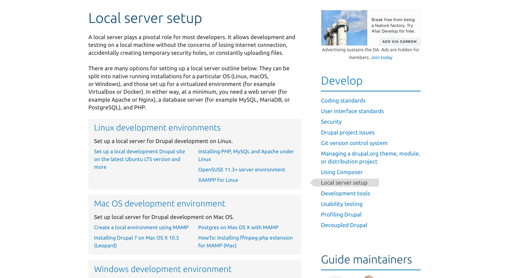
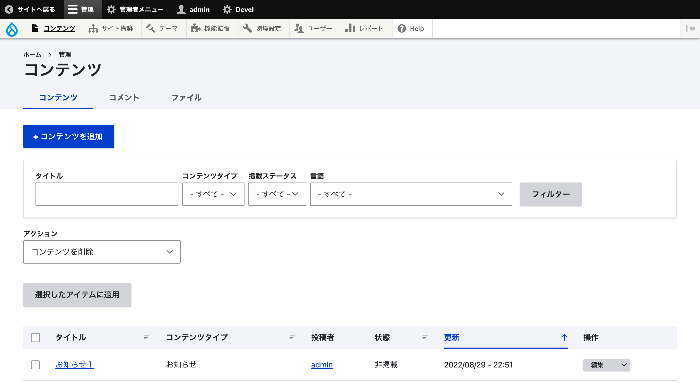

+++
author = "千葉陶也"
title = "Drupalに入門した。"
date = "2022-09-26T13:24:24+09:00"
description = "Drupalの設定に四苦八苦する話"
image= "thumbnail.png"
tags = [
    "開発", "Drupal", "会社"
]
lastmod = '2022-09-26 17:24:24'
+++

## 会社の開発で Drupal を使う

会社の制作で Drupal(ドゥルーパル)というツールを使っていて、そのお手伝い的な感じで参加。  
ローカルの環境作ろうと思って色々調べるところからスタート。

## ローカルの環境構築 💻

既に着手されている方はサーバーで直接作業されていたので、自力で環境構築。  
[ドキュメント](https://www.drupal.org/docs/develop/local-server-setup)によると色々やり方があるらしい。



ドキュメント読みながら、ほぼ全部試したけど全然うまくいかない。  
Apache のエラー出たり、500 番のレスポンス返ってきたりで、涙を流しながら数時間格闘...

## エラー ❌

試行錯誤しつつ、Docker の知識がまだ乏しいので MAMP 🐘 でやることを決意。
MAMP の諸々の設定を終えて、`http://localhost:8888/`にアクセス。


全然ダメ。  
ログはこんな感じ。

```
PDOException: SQLSTATE[HY000] [2002] No such file or directory in /app/web/core/lib/Drupal/Component/DependencyInjection/PhpArrayContainer.php on line 79 #0 /app/web/core/modules/mysql/src/Driver/Database/mysql/Connection.php(189): PDO->__construct('mysql:host=loca...', 'root', 'X/2cGL.g', Array)\n#1 /app/web/core/lib/Drupal/Core/Database/Database.php(411)
```

DB に接続できてないらしいけど、設定ファイルどこだ、、  
エラーメッセージで調べてみると同じく困っている人を見つけた。

https://www.drupal.org/project/drupal/issues/2210153

## ついに、、

設定ファイルらしきものを見つけたので MAMP の設定に合わせたら、、



表示できた！めでたしめでたし。
