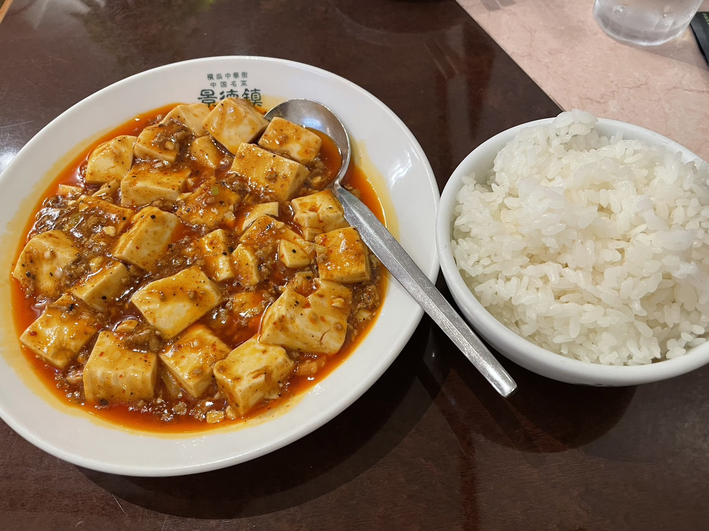

+++
author = "千葉陶也"
title = "インターン最終出勤"
date = "2022-10-01T03:44:17+09:00"
description = ""
image= "thumbnail.jpg"
tags = [
    "インターン", "開発", "会社"
]
lastmod = '2022-09-30 03:44:17'
+++

## インターン最終出勤
入社予定の会社でインターンでお世話になってました。  
本当は8-9月働く予定だったんですが、8月中旬にコロナにかかって結局8月は1日しか出勤できず、実質1ヶ月のインターンでした笑

## 会社について
横浜にある自社開発・受託開発両方やってる会社です。  
もともとインターンで働いていた別の会社でのご縁があって入社する運びになりました。  

社員数は数十名程度の小規模な会社で、フルリモートで働いている人が大半の自由な雰囲気な会社です。  
出社してる人は3~7名ほどで、たまに皆でお昼を食べに行ったりします 🍽  
会社から中華街が近いのでお昼は中華を食べることが多かったです。  
最終日は一人で[景徳鎮](https://tabelog.com/kanagawa/A1401/A140105/14000499/)というお店に行ってきました。  

美味しかったです。
