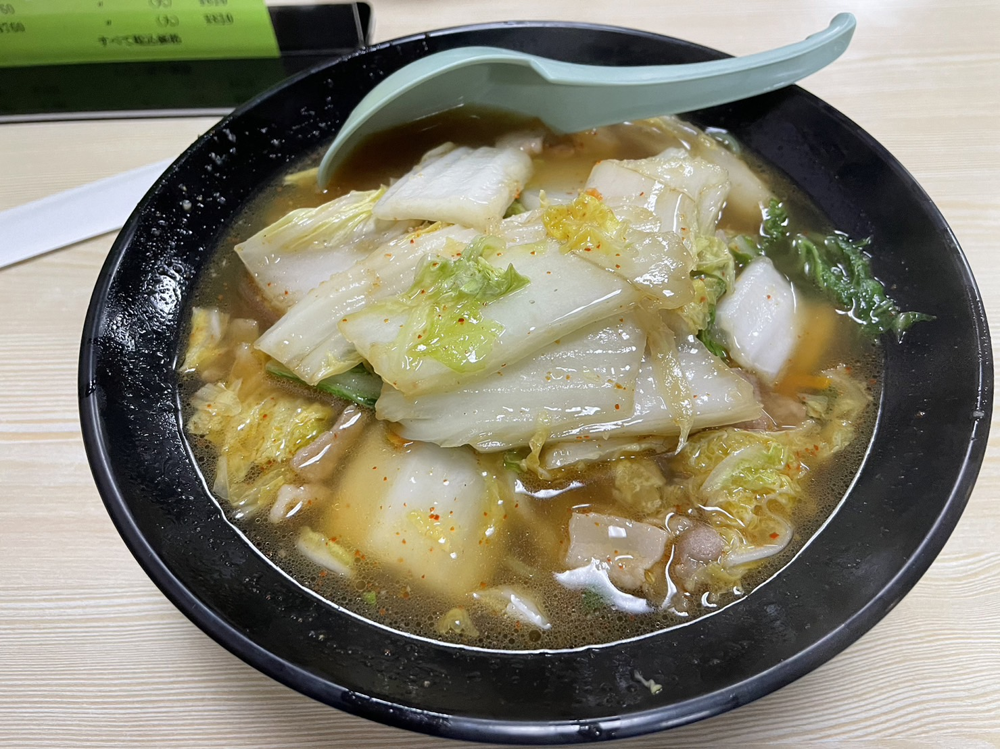
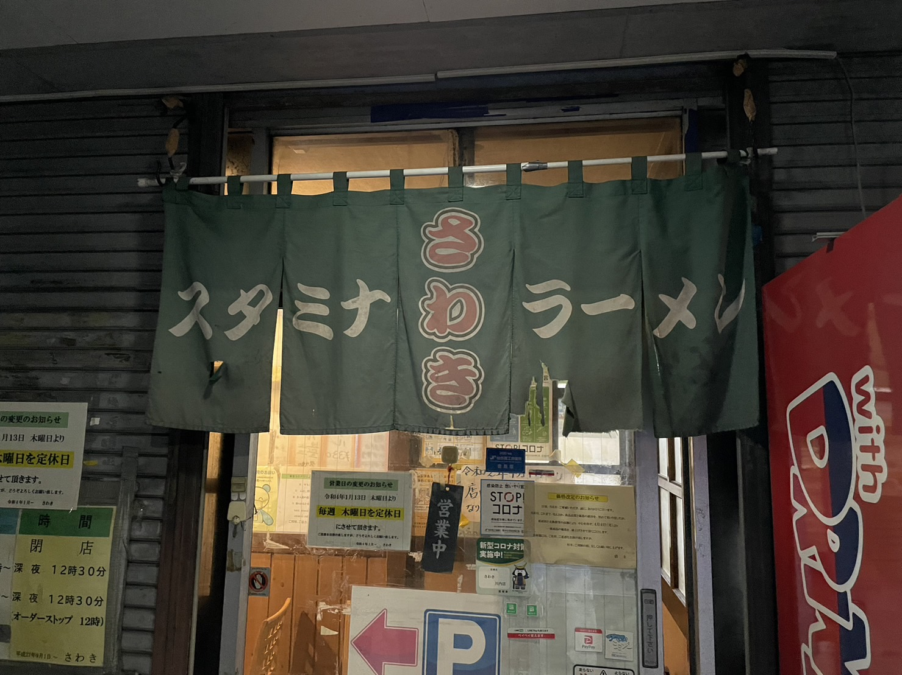
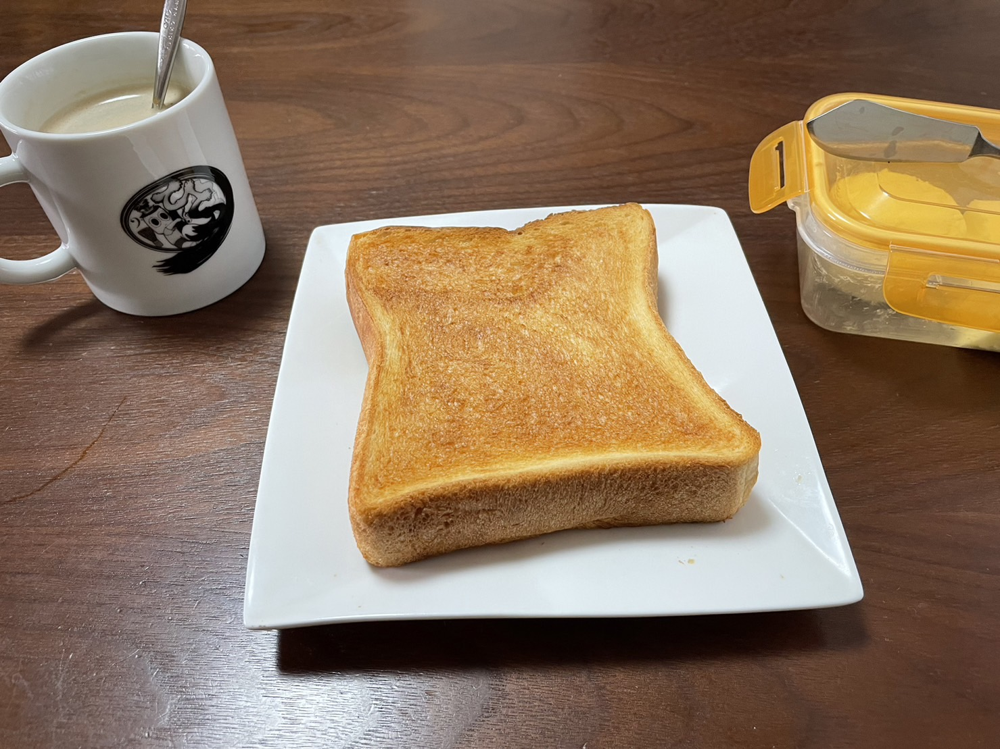
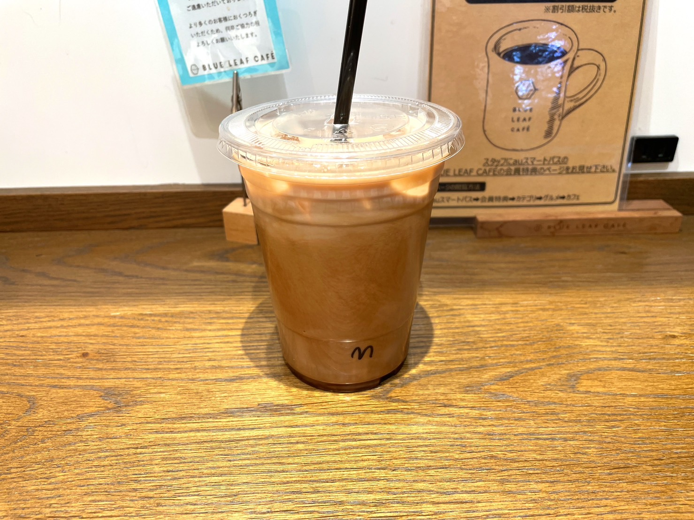

+++
author = "千葉陶也"
title = "仙台に帰ってきた！"
date = "2022-10-03T13:15:24+09:00"
description = "3年ぶりに仙台に帰省しました。"
image= "thumbnail.jpg"
tags = []
lastmod = '2022-10-03 13:15:24'
+++

## 帰省のきっかけ
インターンが終わりそろそろ就職なので、就職までの１ヶ月くらい帰省することにしました。  
最後に帰ったのが大学3年生の頃なので、2,3年ぶりの帰省です。自分は面倒くさがりなのでなかなか帰省せず、大学入学以降1ヶ月も仙台いるのは初めてです。

## 久々の仙台
東京から「はやぶさ」で1時間半。19:30に仙台駅に着いて、歩いて家まで帰りました。  
よく行っていた文房具屋さんが無くなってたり、通ってた塾の新校舎ができていたり、でも変わらない部分もたくさんあったり。  
歩いている高校生の姿を見て、「あ、育英の生徒だ」って思うのも、千葉にいたら感じられない感覚だなって思ったり。  

たまには仙台に帰ってくるのもいいなって思いました。  
[いきたい場所](https://www.google.com/maps/@/data=!3m1!4b1!4m2!11m1!2sL_pHACJZDFlTwPbEWnUUHYj_hYe3Tg)はたくさんあるので1ヶ月のうちに行けるだけ行こうと思います。

## ギャラリー

